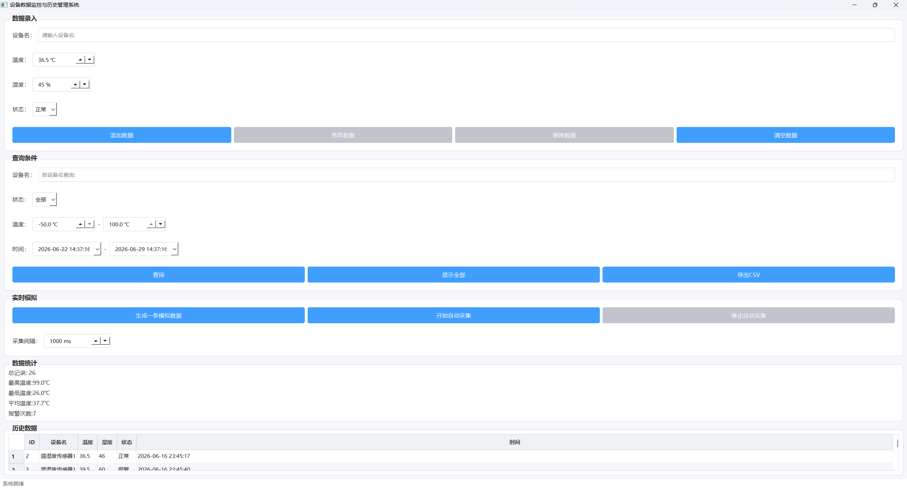
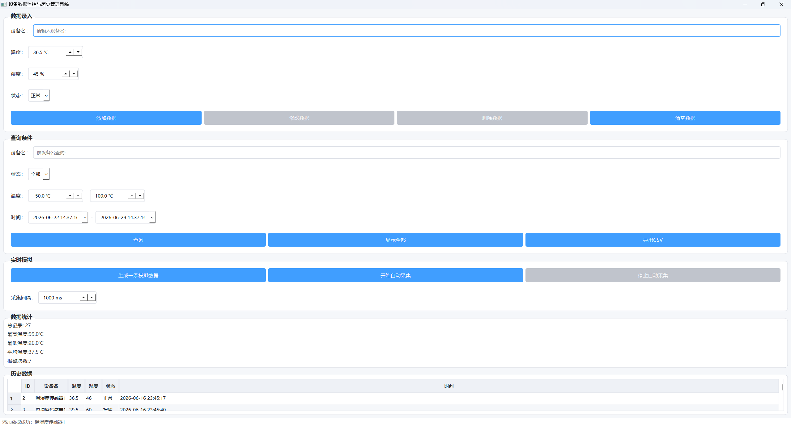
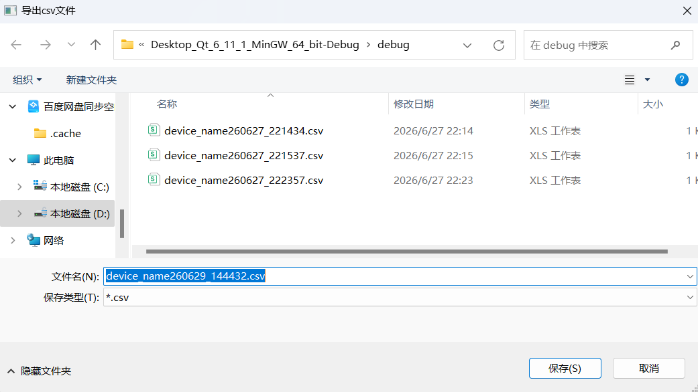
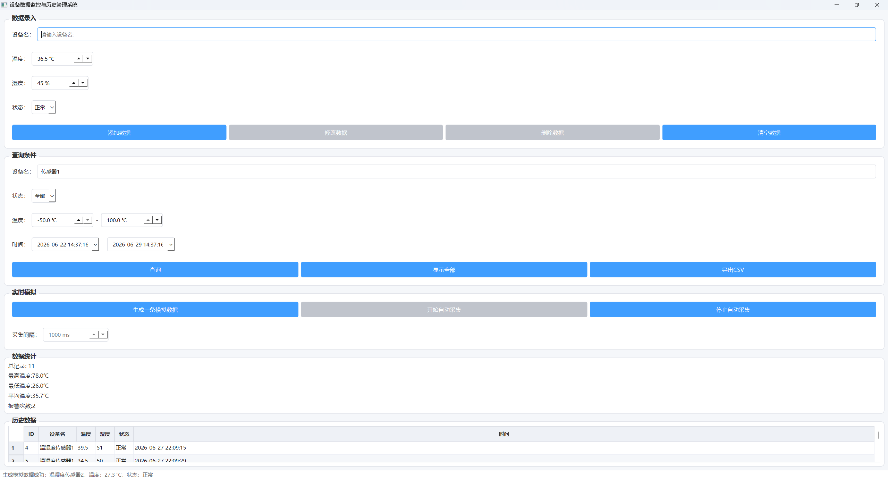

# 基于 Qt + SQLite 的设备数据监控与历史管理系统

## 一、项目简介

本项目基于 C++、Qt Widgets 和 SQLite 开发，实现设备数据录入、历史数据管理、条件查询、数据修改删除、CSV 导出、模拟采集、报警记录、报警高亮和数据统计等功能。

项目主要面向设备监控、工业上位机、传感器数据管理等应用场景，可用于模拟设备数据采集、历史数据存储和异常报警分析流程。

## 二、技术栈

* C++
* Qt Widgets
* SQLite
* QSqlDatabase
* QSqlQuery
* QSqlTableModel
* QTableView
* QTimer
* QFile
* QTextStream
* QStyledItemDelegate
* CSV
* QSS

## 三、主要功能

1. SQLite 数据库初始化
2. 设备数据添加
3. 历史数据表格显示
4. 点击表格数据回填
5. 修改历史数据
6. 删除历史数据
7. 按设备名查询
8. 按设备状态查询
9. 按温度范围查询
10. 按时间范围查询
11. 显示全部数据
12. 导出 CSV 文件
13. 自动生成模拟数据
14. QTimer 定时模拟采集
15. 数据统计
16. 温度报警记录
17. 报警数据高亮显示
18. 界面 QSS 美化

## 四、数据库设计

### 1. 设备数据表 device_data

```sql
CREATE TABLE IF NOT EXISTS device_data (
    id INTEGER PRIMARY KEY AUTOINCREMENT,
    device_name TEXT NOT NULL,
    temperature REAL,
    humidity INTEGER,
    status TEXT,
    created_time TEXT
);
```

字段说明：

| 字段名          | 类型      | 说明    |
| ------------ | ------- | ----- |
| id           | INTEGER | 主键，自增 |
| device_name  | TEXT    | 设备名称  |
| temperature  | REAL    | 温度    |
| humidity     | INTEGER | 湿度    |
| status       | TEXT    | 设备状态  |
| created_time | TEXT    | 采集时间  |

### 2. 报警记录表 alarm_record

```sql
CREATE TABLE IF NOT EXISTS alarm_record (
    id INTEGER PRIMARY KEY AUTOINCREMENT,
    device_name TEXT NOT NULL,
    temperature REAL,
    alarm_type TEXT,
    alarm_message TEXT,
    created_time TEXT
);
```

字段说明：

| 字段名           | 类型      | 说明    |
| ------------- | ------- | ----- |
| id            | INTEGER | 主键，自增 |
| device_name   | TEXT    | 设备名称  |
| temperature   | REAL    | 报警温度  |
| alarm_type    | TEXT    | 报警类型  |
| alarm_message | TEXT    | 报警信息  |
| created_time  | TEXT    | 报警时间  |

## 五、项目结构

```text
DeviceDataManager/
├── main.cpp
├── mainwindow.cpp
├── mainwindow.h
├── mainwindow.ui
├── databasemanager.cpp
├── databasemanager.h
├── datagenerator.cpp
├── datagenerator.h
├── csvexporter.cpp
├── csvexporter.h
├── alarmhighlightdelegate.cpp
├── alarmhighlightdelegate.h
├── device_data.h
├── DeviceDataManager.pro
├── README.md
└── screenshots/
    ├── main_window.png
    ├── add_data.png
    ├── search_data.png
    ├── export_csv.png
    ├── auto_collect.png
    └── alarm_highlight.png
```

## 六、核心模块说明

### 1. DatabaseManager

负责 SQLite 数据库初始化、数据表创建、设备数据新增、修改、删除，以及报警记录写入等功能。

### 2. deviceData

用于封装单条设备数据，包括设备 ID、设备名称、温度、湿度、状态和采集时间。

### 3. DataGenerator

负责随机生成模拟设备数据，包括设备名称、温度、湿度、状态和当前时间，用于模拟设备采集过程。

### 4. CsvExporter

负责将当前表格中的数据导出为 CSV 文件，并处理中文编码和 CSV 字段转义问题。

### 5. AlarmHighlightDelegate

基于 QStyledItemDelegate 实现表格中报警数据的高亮显示，使异常数据更加醒目。

### 6. MainWindow

负责主界面逻辑，包括数据录入、查询、表格刷新、按钮事件、统计信息更新、定时采集和界面美化等功能。

## 七、功能截图

### 主界面



### 添加数据



### 条件查询


### CSV 导出



### 自动采集



### 报警高亮


## 八、运行环境

* Windows 10 / Windows 11
* Qt 6.x
* MinGW 64-bit
* SQLite
* Qt Creator

## 九、运行方式

1. 使用 Qt Creator 打开项目文件 `DeviceDataManager.pro`
2. 确认 `.pro` 文件中包含 Qt Widgets 和 SQL 模块：

```pro
QT += widgets sql
```

3. 选择合适的 Qt 编译套件，例如 MinGW 64-bit
4. 点击“构建”并运行项目
5. 程序启动后会自动创建 SQLite 数据库文件 `device.db`

## 十、项目亮点

* 使用 SQLite 实现本地数据持久化存储
* 使用 QSqlDatabase 和 QSqlQuery 封装数据库操作
* 使用 QSqlTableModel + QTableView 实现数据库表格展示
* 支持设备数据的添加、修改、删除和多条件查询
* 支持按设备名、状态、温度范围和时间范围组合筛选
* 使用 QFile 和 QTextStream 实现 CSV 数据导出
* 使用 QTimer 模拟设备周期性采集数据
* 实现温度阈值报警逻辑，并写入报警记录表
* 使用 QStyledItemDelegate 实现报警数据高亮显示
* 使用 QSS 对界面进行美化
* 采用模块化设计，提高代码可维护性

## 十一、后续优化方向

* 增加报警记录单独展示页面
* 增加温度变化折线图
* 增加用户登录和权限管理
* 支持串口真实设备数据接入
* 支持数据分页查询
* 支持报警阈值自定义配置
* 支持数据备份与恢复

## 十二、项目总结

本项目完成了一个基于 Qt + SQLite 的桌面端设备数据管理系统，涵盖了界面开发、数据库操作、表格展示、条件查询、CSV 导出、定时任务、报警逻辑和界面美化等内容。通过该项目，熟悉了 Qt Widgets 桌面应用开发流程，并掌握了 SQLite 数据库在本地数据管理场景中的基本使用方式。